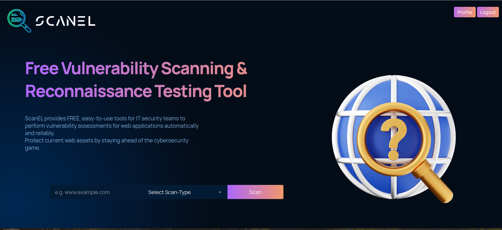

# ScanEL

ScanEL is an award-winning web-based vulnerability and reconnaissance scanner that revolutionizes the way you secure your web applications. It provides a comprehensive analysis of your website based on the scaned tools, identifying vulnerabilities and generating detailed reports.

Scanel is a centralized platform designed to streamline the usage of multiple reconnaissance tools through a convenient web interface. 
With Scanel, users can effortlessly run various recon tools without the hassle of manual installation or configuration.
By offering a web-based interface, Scanel removes the reliance on traditional command-line interfaces, making it easily accessible to users. It creates a user-friendly environment that enhances the efficiency of reconnaissance tasks, catering to users of all technical backgrounds.
## Stack

- ReactJS
- Bash
- Python
- Fastapi
- Google Cloud

## Project Recognition

ScanEL has been recognized for its excellence in security and innovation:

- Top 3 Project at Mumbai Hacks: ScanEL was selected as one of the top 3 projects at Mumbai Hacks, showcasing its effectiveness and potential.
- Postman Sponsor Track Winner at HackThis Fall: ScanEL won the prestigious sponsor track by Postman at HackThis Fall, recognizing its outstanding contribution to web application security.

## Roadmap

ScanEL is currently undergoing further enhancements and modifications to bring you an even more powerful and user-friendly experience. Stay tuned for updates as we strive to make ScanEL available to a wider audience.

